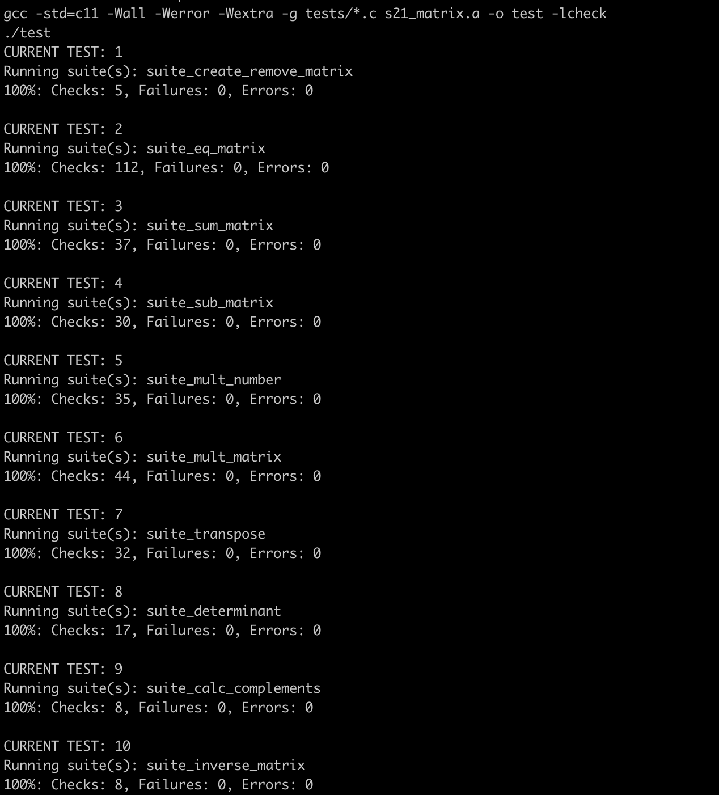
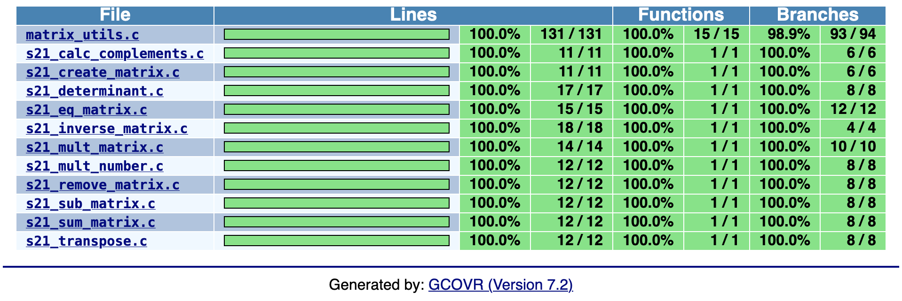
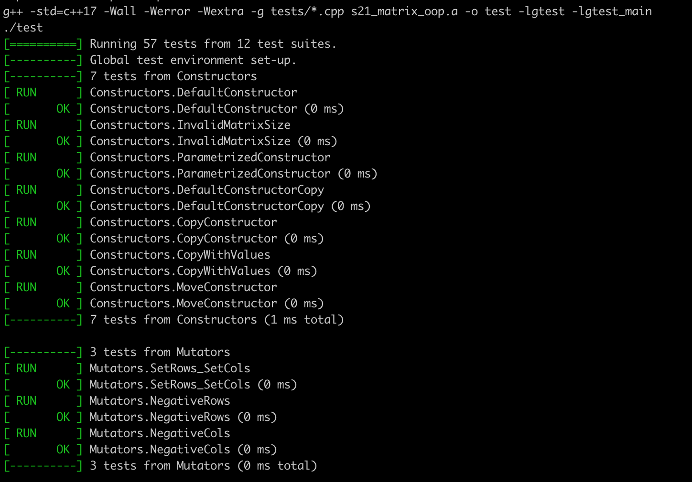
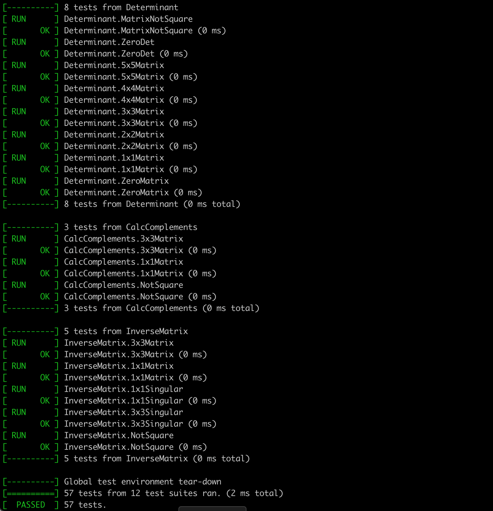
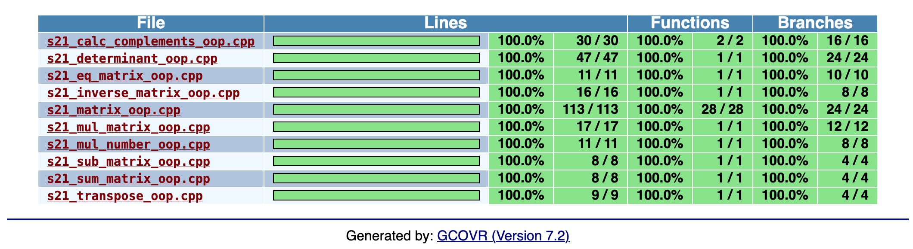
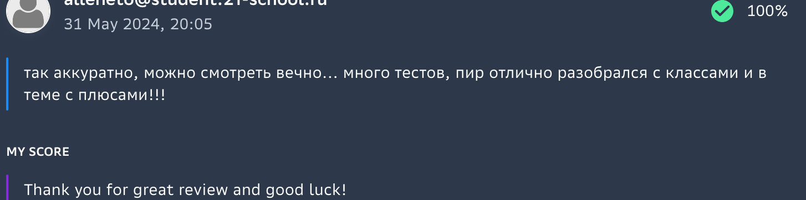

### Check vs. GTest
- Реализация библиотеки для обработки числовых матриц на языке программирования Си в соответствии с принципами структурного программирования, которая включает следующие основные действия с матрицами: create\_matrix (создание), remove\_matrix (очистка и уничтожение), eq\_matrix (сравнение), sum\_matrix (сложение), sub\_matrix (вычитание), mult\_matrix (умножение), mult\_number (умножение на число), transpose (транспонирование), determinant (вычисление определителя), calc\_complements (вычисление матрицы алгебраических дополнений), inverse\_matrix (поиск обратной матрицы). Полное покрытие **unit**-тестами функций библиотеки c помощью библиотеки **Check**. Формирование отчёта **gcov** в виде **html** страницы путем запуска цели **gcov\_report**, а также проверка на утечки памяти при помощи valgrind при запуске цели **test\_leaks**.
	
	
	
- Реализация этой же библиотеки, но уже на языке С++, используя объектно-ориентированный подход, то есть в виде отдельного класса, над объектами которого определены операции, представленные как методами, так и стандартными операторами +, -, * и т.д. Полное покрытие **unit**-тестами функций библиотеки c помощью библиотеки **GTest**, формирование отчета и проверка на утечки памяти аналогично проекту на Си.
	
	
	
	