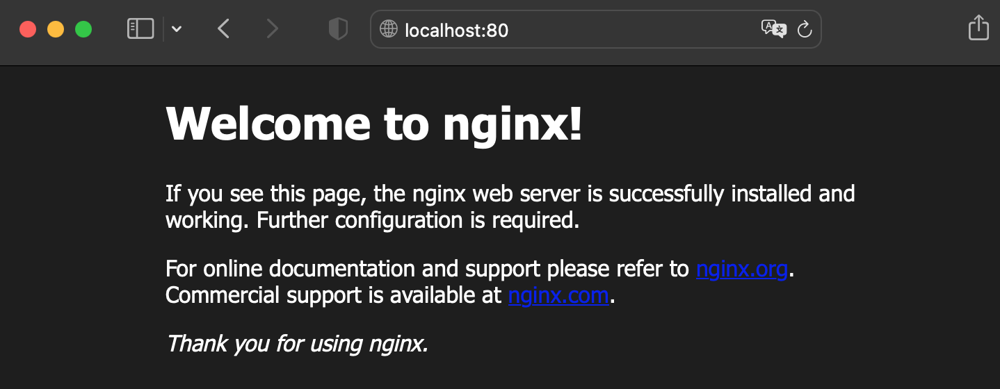
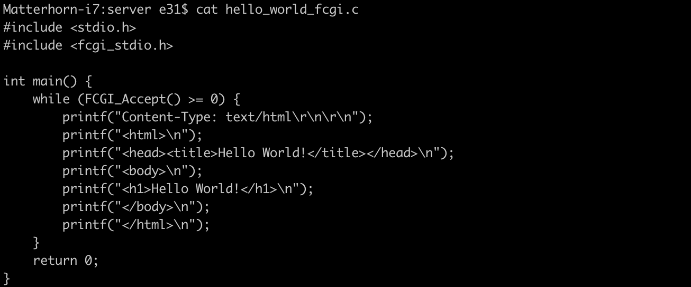
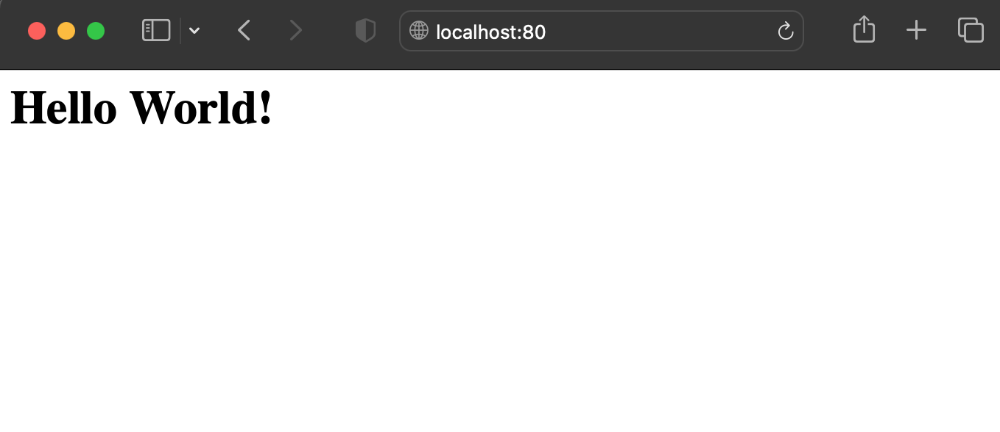
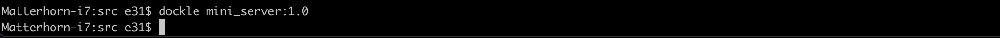
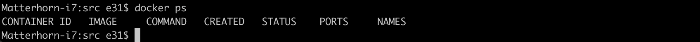
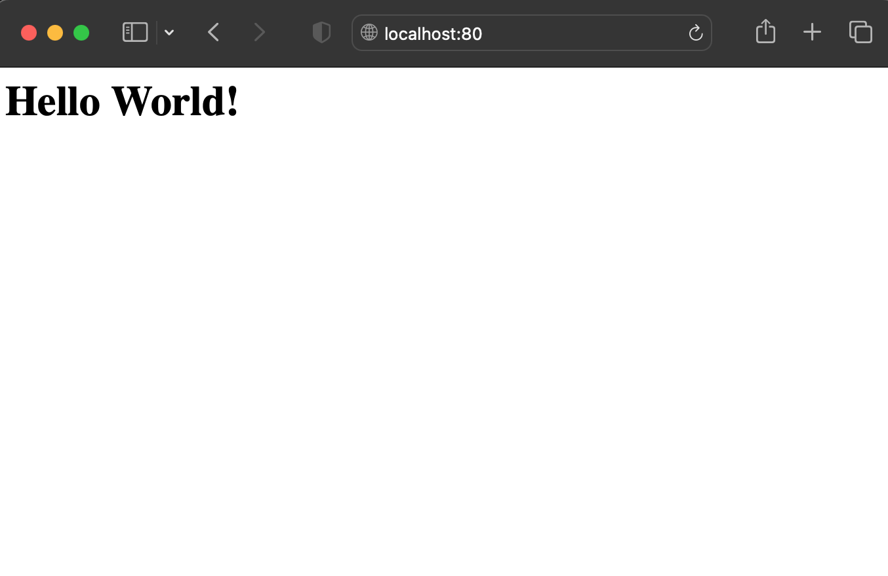

# Simple Docker

Разработка и настройка докер-образа (на базе **nginx**) для собственного сервера на C и FastCgi, проверка безопасности и поиск уязвимостей образа при помощи **Dockle**, а также развёртывание проекта, состоящего сразу из нескольких докер-образов (через **Docker Compose**).

## Contents

1. [Ready-made docker](#part-1-ready-made-docker)
2. [Operations with container](#part-2-operations-with-container)
3. [Mini web server](#part-3-mini-web-server)
4. [Your own docker](#part-4-your-own-docker)
5. [Dockle](#part-5-dockle)
6. [Basic Docker Compose](#part-6-basic-docker-compose)

## Part 1. Ready-made docker
- Downloading the official docker image from nginx using `docker pull nginx` command.
	
	
- Checking for the docker image with `docker images` command.
	
	
- Running docker image with `docker run -d [image_id|repository]` and checking that the image is running with `docker ps` commands.
	
	
- Viewing container information with `docker inspect [container_id|container_name]` command.
	

- `docker inspect --size [container_id|container_name]` to define container size in bytes.
	

- Container ip is **172.17.0.2** and port **80** is mapped.	

- Stopping docker image with `docker stop [container_id|container_name]`and checking that the image has stopped with `docker ps` commands.
	
	
- Running docker with ports **80** and **443** in container, mapped to the same ports on the local machine, with `docker run -d -p 80:80 -p 443:443 [image_id|repository]` command.
	
	
- Checking that the nginx start page is available in the browser at *localhost:80*
	
	
- Restarting docker container with `docker restart [container_id|container_name]`and checking the container is running with `docker ps` commands.
	
	
## Part 2. Operations with container
- Reading the **nginx.conf** configuration file inside the docker container with `docker exec [container_id|container_name] cat /etc/nginx/nginx.conf` command.
	

- *nginx.conf* file on a local machine configured to return the nginx server status page on the */status* path.
	
	
- Copying locally created **nginx.conf** file inside the docker image using the `docker cp nginx.conf [container_id|container_name]:/etc/nginx/nginx.conf` command and reloading **nginx** configuration inside the docker image with `docker exec [container_id|container_name] nginx -s reload` command.
	
	
- *localhost:80/status* returns the **nginx** server status page.
	
	
- `docker export [container_id|container_name] > container.tar` and
`docker stop [container_id|container_name]` commands.
	

- Deleting the image with `docker rmi -f [image_id|repository]` command without removing the container.
	
	
- Deleting stopped container with `docker rm [container_id|container_name]` command.
	
	
- Importing the container back using the `docker import container.tar [repository]`command.
	
	
- Running the imported container with settings `docker run -i -t -d -p 80:80 -p 443:443 [image_id|repository] nginx -g "daemon off;"`
	

- *Localhost:80/status* returns the **nginx** server status page.
	
	
## Part 3. Mini web server
- Source code for mini server in C and FastCgi that will return a simple page saying `Hello World!`.
	
	
- *nginx.conf* that will proxy all requests from port 81 to *127.0.0.1:8080*.
	

- Using commands from [Part 1](#part-1-ready-made-docker) to download and run  docker with port **81** in container, mapped to the same port on the local machine.
	

- Using commands from [Part 2](#part-2-operations-with-container) to copy locally created **nginx.conf** and source code for mini server files inside the docker image.
	
	
- Executing a shell session inside a running Docker container with `docker exec -it [container_id|container_name] bash` command and installing packages required to compile and run mini server with `apt-get update && apt-get install -y gcc spawn-fcgi libfcgi-dev` command.
	
	
- Compiling source file for mini server into an executable, linking it with the **fcgi** library with `gcc -o [executable] [source_file.c] -lfcgi` command, running mini server via **spawn-fcgi** on port **8080** with `spawn-fcgi -p 8080 ./[executable]` command and reloading **nginx** configuration to proxy all requests from port **81** to **127.0.0.1:8080** with `nginx -s reload` command.
	

- Checking that the inscription "Hello World!" is shown in the browser at the address *localhost:81*.
	<kbd>
	
## Part 4. Your own docker
-  Writing the docker image for the created server using a ready-made image with **nginx** as base and script to compile and run server inside container.
	
	

- Building the written docker image with `docker build`, specifying the name and tag.
	
	
- Checking with `docker images` that everything is built correctly.
	

- Running the built docker image by mapping port **81** to **80** on the local machine and mapping the *./nginx* folder inside the container to the address where the **nginx** configuration files are located using `docker run -p 80:81 -v $(pwd)/server/nginx:/etc/nginx [repository:tag]` command.
	

- Checking that the page of the written mini server is available on *localhost:80*.
	<kbd>
	
- *nginx.conf* file on a local machine configured to return the nginx server status page on the */status* path.
	

- Restarting docker image.
	

- Validating proper mapping of the *./nginx* folder inside the container: after saving the file (on a local machine) and restarting the container, the configuration file inside the docker image updated itself without any extra steps (docker image rebuild is not required). Checking that *localhost:80/status* now returns a page with nginx status.
	
	   
## Part 5. **Dockle**
- Using *.dockleignore* file in order to avoid errors or warnings when checking with dockle and using a ready-made image with **nginx** as base for the created server.
	
- No errors or warnings when checking with with `dockle [image_id|repository]` command.
	
	
## Part 6. Basic **Docker Compose**
- *docker-compose.yml* file.
	

- *nginx.conf* file on a local machine for *docker-compose.yml* file to proxy all requests from port **8080** of the second container to port **81** of the first container.
	

- No containers running.
	

- Building and running the project with the `docker-compose build` and `docker-compose up` commands.
	
	

- Checking that the browser returns the page of the written mini server on *localhost:80* as before.	
	<kbd>
	
	