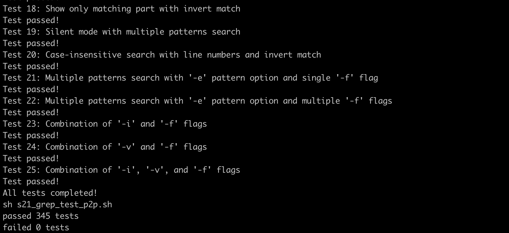
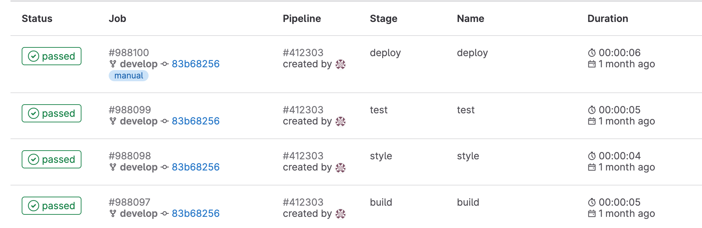

### Ручное vs. Автоматизированное тестирование

Проект, демонстрирующий оба варианта тестирования:

- Ручное тестирование на примере покрытия интеграционными тестами утилит, написанных на языке Си стандарта C11, **сat** и **grep** собственной разработки. Тесты реализованы в формате скриптов для всех поддерживаемых вариантов флагов и их комбинаций, краевых случаев и входных значений, на базе сравнения с поведением реальных утилит Bash.
		
	- тесты **cat**:
	
	
	- тесты **grep**:
	
	
	

- Автоматизированное тестирование этих же утилит, но уже внутри конвейера **CI/CD** на базе **GitLab** с использованием двух **Ubuntu Server 22.04 LTS** (без GUI). Проект включает в себя решение следующих задач: настройка **gitlab-runner** (на виртуальном сервере), этапы для **CI** по сборке, проверке кода на соответствие Google стилю, запуск интеграционных тестов, этап для **CD**, который «разворачивает» проект на другой виртуальной машине через **bash**-скрипт, который при помощи **ssh** и **scp** копирует файлы, полученные после сборки (артефакты), в директорию */usr/local/bin* второй виртуальной машины, а также настройка уведомлений о успешном/неуспешном выполнении пайплайна через бота в Telegram.  Подробный отчет о проекте со всеми деталями по [ссылке](https://github.com/zhdanov-n/zhdanov-n/blob/main/manual_vs_automated/automated/readme.md).
	
	
	  