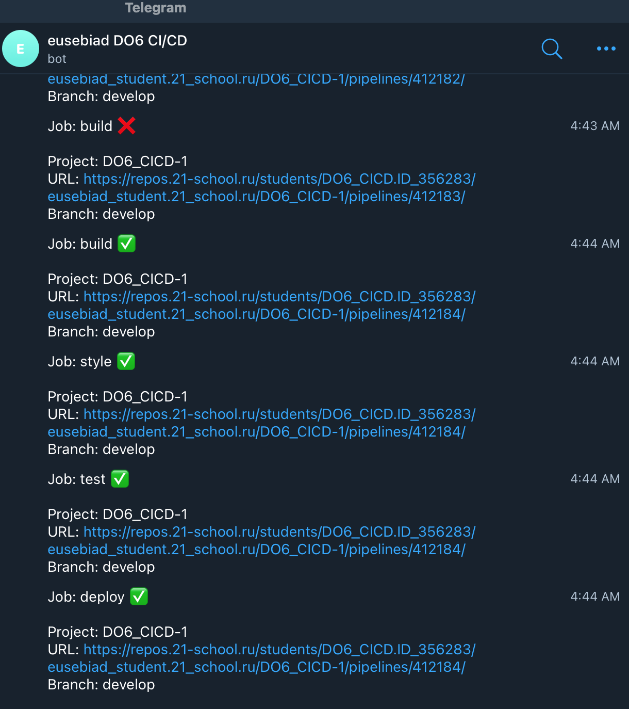

# Basic CI/CD

## Contents

1. [Setting up the gitlab-runner](#part-1-setting-up-the-gitlab-runner)
2. [Building](#part-2-building)
3. [Codestyle test](#part-3-codestyle-test)
4. [Integration tests](#part-4-integration-tests)
5. [Deployment stage](#part-5-deployment-stage)
6. [Bonus. Notifications](#part-6-bonus-notifications)

## Part 1. Setting up the **gitlab-runner**
- To download and install gitlab-runner on **Ubuntu Server 22.04 LTS** virtual machine first installing required dependencies with `sudo apt-get install -y curl wget gnupg2` command.
	
	
- Adding the GitLab Runner repository with `curl -L https://packages.gitlab.com/install/repositories/runner/gitlab-runner/script.deb.sh | sudo bash` command.
	
	
- Installing GitLab Runner with `sudo apt-get install gitlab-runner` command.
	
	
- Running **gitlab-runner** and registering it for use in the current project (**DO6_CICD**) with `sudo gitlab-runner register` providing GitLab instance URL, the registration token, a description for the Runner, tags (if any), and the executor (e.g., shell, docker, etc.).
	
	
## Part 2. Building
- Writing a stage for **CI** to build applications from the **C2_SimpleBashUtils** project. In the *.gitlab-ci.yml* file, adding a stage to start the building via makefile from the **C2** project. Saving post-build files (artifacts) to a random directory with a 30-day retention period.
	
- Starting the GitLab Runner service with `sudo gitlab-runner start` command and running stage build applications from the **C2_SimpleBashUtils** project with `sudo gitlab-runner run` command.
	

- Checking **Jobs** section in **GitLab UI CI/CD** to confirm successful build.
	
	
## Part 3. Codestyle test
- Adding **style** part to stages section of *.gitlab-ci.yml* file and writing a stage for **CI** that runs a codestyle (Google style) script (**clang-format**).
	
	```
	stages:
  - build
  - style
	```
	```
	stages:
  style:
  stage: style
  script:
    clang-format -style=Google -Werror -n src/cat/*.c src/cat/*.h src/grep/*.c src/grep/*.h
	```
- Checking **Jobs** section in **GitLab UI CI/CD** to confirm successful style check.
 
 
## Part 4. Integration tests
- Adding **test** part to stages section of *.gitlab-ci.yml* file and writing a stage for **CI** that runs integration tests from the **C2** project
	
	```
	stages:
  - build
  - style
  - test
	```
	```
	test:
  stage: test
  script:
    - cd src/cat/
    - bash cat_test.sh
    - cd ../grep/
    - bash grep_test.sh
  allow_failure: false
	```
- Adding `allow_failure: false` condition to **build** and **style** stages in order to run integration tests stage automatically **only if** the build and codestyle test **succeed**.

	```
	build:
  stage: build
  script:
    - cd src/cat/
    - make
    - cd ../grep/
    - make
  allow_failure: false
  artifacts:
    paths:
    - src/cat/s21_cat
    - src/grep/s21_grep
    expire_in: 30 days
	
	style:
  stage: style
  script:
    clang-format -style=Google -Werror -n src/cat/*.c src/cat/*.h src/grep/*.c src/grep/*.h
  allow_failure: false
	```


- Checking **Jobs** section in **GitLab UI CI/CD** to confirm integration tests job succeeded.
 
 
## Part 5. Deployment stage
- Adding a static route between first and second **Ubuntu Server 22.04 LTS** machines.
	
	

- Switching to the **gitlab-runner** user using `sudo su gitlab-runner` command.
	

- Generating **SSH-key** for **gitlab-runner** user using `ssh-keygen` command.
	

- Copying **SSH-key** for **gitlab-runner** user to second virtual machine using `ssh-copy-id -i /home/gitlab-runner/.ssh/id_rsa.pub [valid_username_on_second machine]@[hostname]` command.
	

- Switching to **root** on second virtual machine using `sudo su root` command.
	
	
- Copying **gitlab-runner** user **SSH-key** to **root** *authorized_keys* using `cd /root/.ssh/ && cp /home/[valid_username_on_second machine]/.ssh/authorized_keys authorized_keys` command.
	

- Allowing **root** login via **SSH** on second machine by editing */etc/ssh/sshd_config* file.
	
	
- Bash script which copies the files received after the building (artifacts) into the */usr/local/bin* directory of the second virtual machine using **ssh** and **scp**.

	```
	#!/bin/bash
	REMOTE_HOST="[HOSTNAME_OF_SECOND_VIRTUAL_MACHINE]"
	USERNAME="root"
	CAT_BINARY_PATH="src/cat/s21_cat"
	GREP_BINARY_PATH="src/grep/s21_grep"
	REMOTE_DESTINATION="/usr/local/bin/"
	scp $CAT_BINARY_PATH $USERNAME@$REMOTE_HOST:/usr/local/bin
	scp $GREP_BINARY_PATH $USERNAME@$REMOTE_HOST:/usr/local/bin
	if [ $? -eq 0 ]; then
 	echo "Deploy success."
	else
	echo "Deploy failure."
	exit 1
	```
- Adding **deploy** part to stages section of *.gitlab-ci.yml* file and writing a stage for **CD** that "deploys" the project on another virtual machine by running script. In order to run this stage manually `when: manual` condition is added.

	```
	stages:
  - build
  - style
  - test
  - deploy
	```
	
	```
	stages:
  deploy:
  stage: deploy
  script:
    - bash src/deploy.sh
  when: manual
  allow_failure: false
	```

- Checking **Jobs** section in **GitLab UI CI/CD** to confirm deploy succeeded.
	
	
- Checking that **s21_cat** and **s21_grep** applications are ready to run on the second virtual machine in */usr/local/bin/* directory.
	
	
- Checking that if any job/stage fails the pipeline will fail too, and subsequent stages and jobs are not executed.
	
	
## Part 6. Bonus. Notifications
- Notifications of successful/unsuccessful pipeline execution via bot named "[your nickname] DO6 CI/CD" in Telegram.
	
